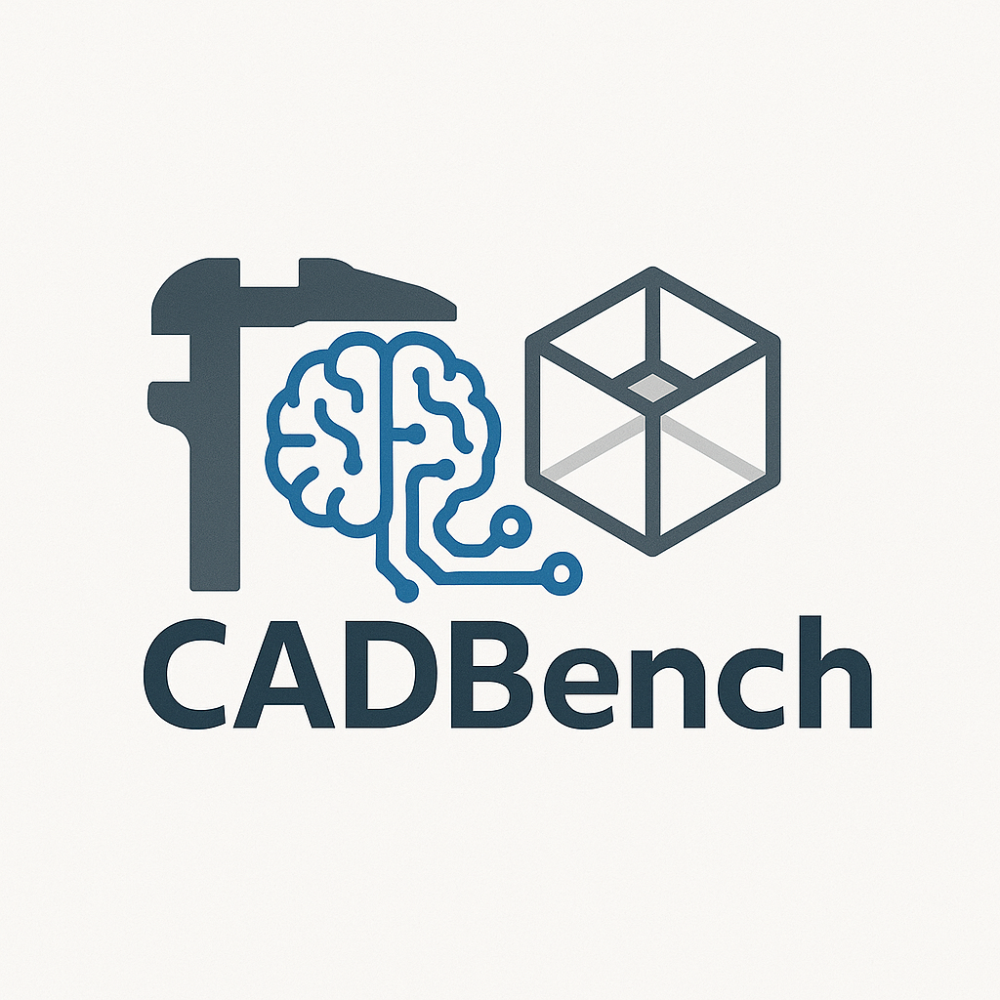

# CADBench

<p align="center">
  
</p>

Source code for the CADBench LLM benchmark

## Getting Started

1.  **Set up the environment and install dependencies:**

    First, ensure you have `uv` installed (see [uv's installation guide](https://github.com/astral-sh/uv#installation)).

    Then, create a virtual environment using Python 3.12+ and install dependencies:

    ```bash
    # Create and activate a virtual environment (e.g., with Python 3.12)
    uv venv .venv --python 3.12
    source .venv/bin/activate

    # Install dependencies from pyproject.toml and sync with uv.lock
    uv sync
    ```

    If you modify `pyproject.toml` (e.g., add a new dependency), run:
    ```bash
    uv lock
    uv sync
    ```
    to update `uv.lock` and your environment.

2.  **Set your API Keys (required):**

    Create a `.env` file in the project root with your API keys:

    ```env
    OPENAI_API_KEY="sk-..."  # Required for OpenAI models (GPT-4o, GPT-3.5-turbo)
    ANTHROPIC_API_KEY="sk-ant-..."  # Required for Claude models
    GEMINI_API_KEY="..."  # Required for Google Gemini models
    ```

    **Important**: API keys are required. Without the corresponding API keys, the models will fail to generate CAD scripts.

3.  **Run the Flask application:**

    ```bash
    python app.py
    ```

4.  Open your browser to [http://localhost:8000](http://localhost:8000) to use CADBench.

## Features

- **Head-to-Head LLM Comparison**: Compare how different LLMs generate CAD models for the same prompt
- **Supported Models**:
  - OpenAI: GPT-4o, GPT-4o-mini, GPT-4.1, o1, o3, o4-mini
  - Anthropic: 
    - Claude 3.7: Claude 3.7 Sonnet
    - Claude 3.5: Claude 3.5 Sonnet (v1 and v2), Claude 3.5 Haiku
    - Claude 3: Claude 3 Opus, Claude 3 Sonnet, Claude 3 Haiku
  - Google: Gemini 2.5 Pro, Gemini 2.5 Flash
- **Side-by-Side Visualization**: See the 3D models generated by each LLM right next to each other
- **FreeCAD Integration**: Generated scripts are executed to create actual CAD models

## FreeCAD Integration

For CADBench to execute the generated Python scripts and produce `.FCStd` files, Docker must be installed and running.

*   **Docker (Required):**
    This app uses Docker to run FreeCAD in a consistent and isolated environment.

    1.  **Ensure Docker is installed and running:**
        ```bash
        docker --version
        ```

    2.  **Pull the FreeCAD Docker image:**
        ```bash
        docker pull linuxserver/freecad:0.20.2
        ```

**FreeCAD Integration:**

If FreeCAD is installed and `freecadcmd` (or `FreeCADCmd`) is available on your system's PATH, the generated Python script will be executed by the backend. The resulting `.FCStd` file will then be available for download from the web interface. Otherwise, only the script itself will be displayed.