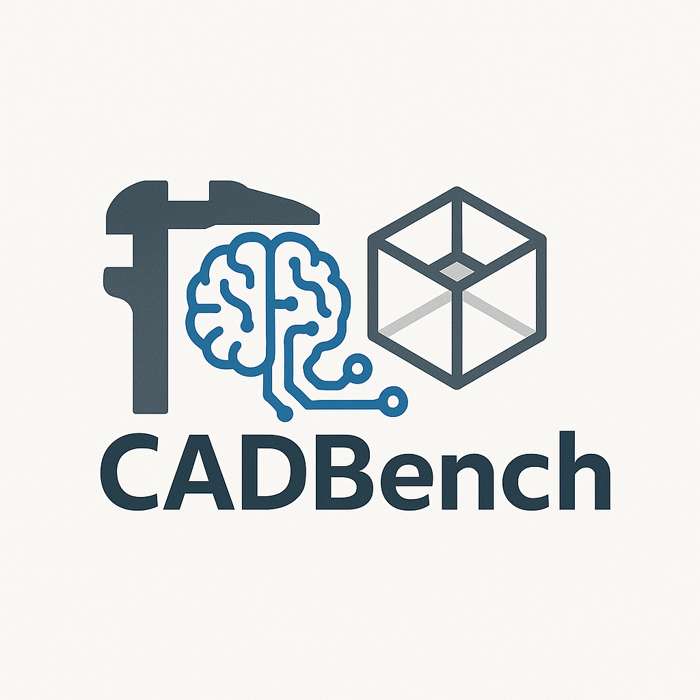

# CADBench

<p align="center">
  
</p>

Source code for the CADBench LLM benchmark

## Getting Started

1.  **Set up the environment and install dependencies:**

    First, ensure you have `uv` installed (see [uv's installation guide](https://github.com/astral-sh/uv#installation)).

    Then, create a virtual environment using Python 3.12 or newer and install dependencies:

    ```bash
    # Create and activate a virtual environment (e.g., with Python 3.12)
    uv venv .venv --python 3.12
    source .venv/bin/activate

    # Install dependencies from pyproject.toml and sync with uv.lock
    uv sync
    ```

    For development tooling, include the dev dependency group:

    ```bash
    uv sync --group dev
    ```

    If you modify `pyproject.toml` (e.g., add a new dependency), run:
    ```bash
    uv lock
    uv sync
    ```
    to update `uv.lock` and your environment.

2.  **Set your API key (required for generation):**

    Create a `.env` file in the project root with your OpenRouter API key:

    ```env
    OPENROUTER_API_KEY="sk-or-..."
    ```

    **Important**: the OpenRouter model list can be fetched without a key, but generation requires `OPENROUTER_API_KEY`.

    Generation length defaults to `8192` output tokens. You can override it if a provider supports a different cap:

    ```env
    OPENROUTER_MAX_TOKENS=12000
    ```

3.  **Run the Flask application:**

    ```bash
    uv run python app.py
    ```

4.  Open your browser to [http://localhost:8000](http://localhost:8000) to use CADBench.

## Features

- **Head-to-Head LLM Comparison**: Compare how different LLMs generate CAD models for the same prompt
- **Supported Models**:
  - OpenRouter free text-generation models (`:free`) are loaded live from the OpenRouter Models API.
  - When `OPENROUTER_API_KEY` is set, the model list is filtered through OpenRouter's account-aware `/api/v1/models/user` endpoint so unavailable models are hidden.
  - Very small-context models are filtered out because they are poor fits for FreeCAD script generation.
  - Generation uses OpenRouter's OpenAI-compatible chat completions endpoint.
- **Side-by-Side Visualization**: See the 3D models generated by each LLM right next to each other
- **FreeCAD Integration**: Generated scripts are executed to create actual CAD models
- **Parallel Generation and Repair**: Model A and Model B generate concurrently. If FreeCAD fails, CADBench asks the model for one repair attempt using the traceback before returning the result.
- **Debugging Aids**: The UI shows provider metadata, staged progress, copy buttons, and the original failed script when a repair succeeds.

## FreeCAD Integration

For CADBench to execute the generated Python scripts and produce `.FCStd` files, Docker must be installed and running.

*   **Docker (Required):**
    This app uses Docker to run FreeCAD in a consistent and isolated environment.

    1.  **Ensure Docker is installed and running:**
        ```bash
        docker --version
        ```

    2.  **Pull the FreeCAD Docker image:**
        ```bash
        docker pull linuxserver/freecad:0.20.2
        ```

Generated `.FCStd` and `.stl` files are written under `static/generated/<request-id>/` and are served by the web UI. Old generated artifact directories are cleaned up automatically after 24 hours.

## Development

Run the test suite with:

```bash
uv run pytest
```

Run linting with:

```bash
uv run ruff check .
```
